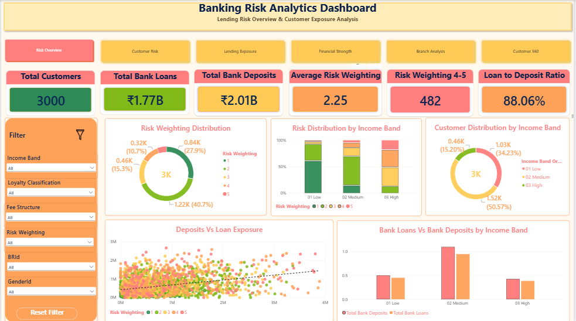
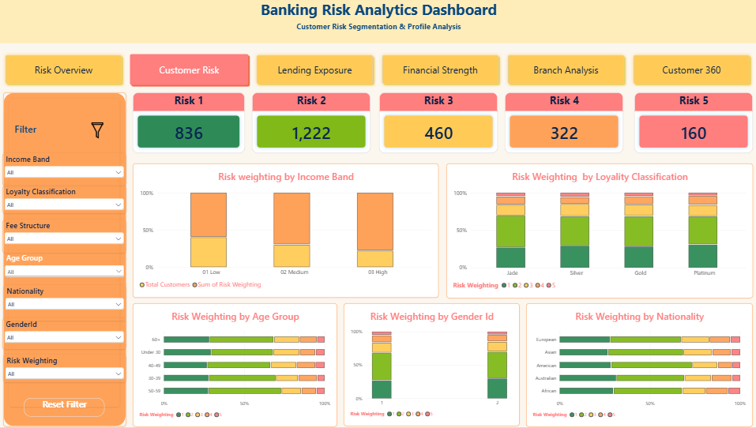
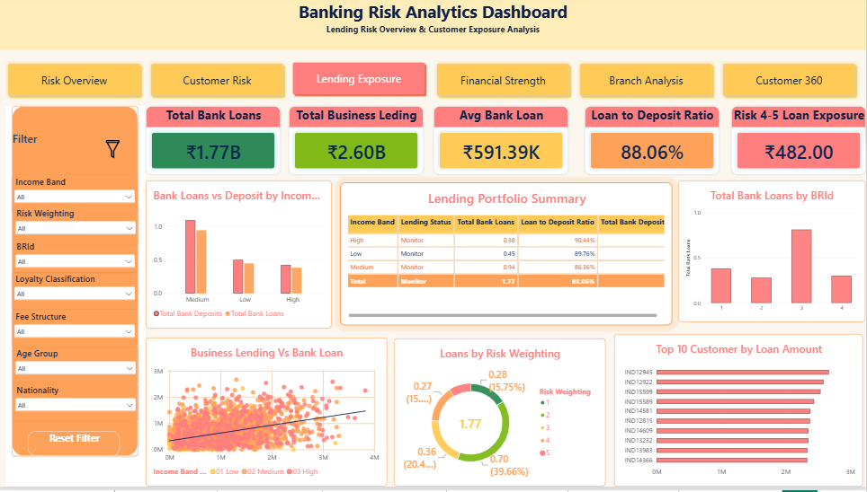
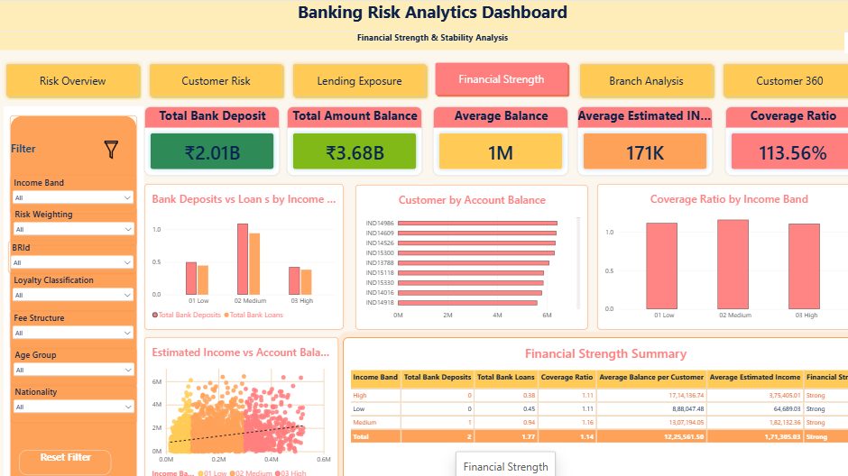
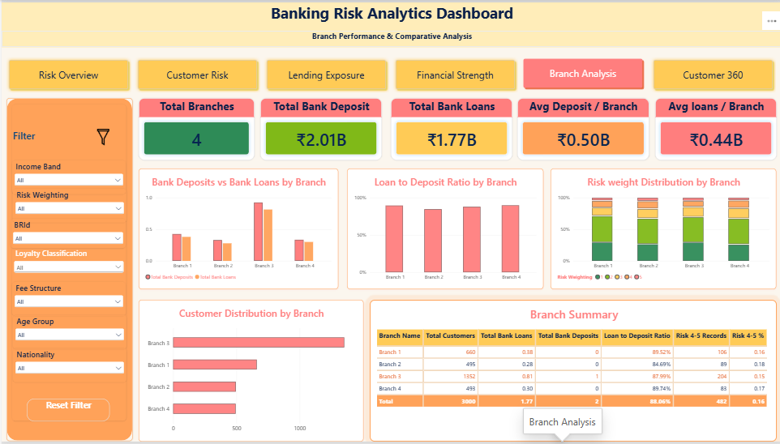
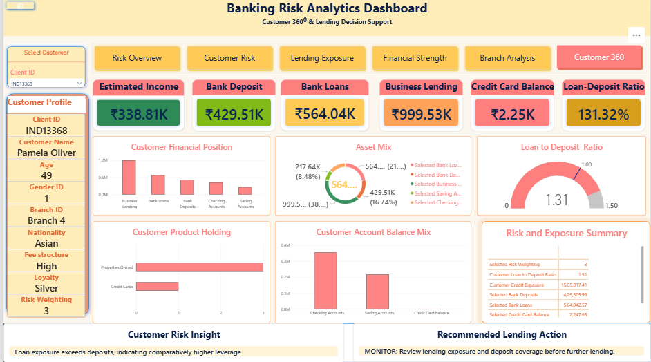

# 🏦 Banking Risk Analytics Dashboard

<p align="center">
  
  
  
  
  
  
  
</p>

## 📌 Overview

The **Banking Risk Analytics Dashboard** is an end-to-end data analytics project that analyzes customer financial behavior, lending exposure, deposits, risk weighting, financial strength, and branch performance.

The project combines:

- **Python** for data loading, preprocessing, cleaning, exploratory data analysis (EDA), and feature engineering.
- **MySQL / SQL** for structured querying, aggregation, customer segmentation, branch analysis, and lending-risk analysis.
- **Power BI** for interactive dashboard development using Power Query and DAX.

The final dashboard contains **6 analytical pages** designed to support portfolio monitoring and lending decision analysis.

---

## 🎯 Problem Statement

Banks and financial institutions need to understand customer financial strength and lending exposure before extending additional credit. Raw banking data contains multiple demographic, deposit, loan, account, and risk-related attributes that are difficult to interpret directly.

This project transforms raw banking customer data into meaningful insights by:

- analyzing customer risk weighting,
- comparing loans and deposits,
- evaluating lending exposure,
- studying financial strength,
- comparing branch-level performance,
- and providing a detailed **Customer 360°** view.

> **Note:** Risk categories, monitoring thresholds, financial-strength labels, and lending recommendations in this project are analytical/project-defined rules and are not official banking or regulatory standards.

---

## ✅ Dataset Validation

The corrected dataset contains:

| Metric | Value |
|---|---:|
| Total Customer Records | **3,000** |
| Unique Client IDs | **3,000** |
| Duplicate Client IDs | **0** |
| Exact Duplicate Rows | **0** |
| Total Columns | **25** |

Each row represents one unique banking customer.

---

## 📂 Dataset Features

| Category | Example Fields |
|---|---|
| Customer Profile | Client ID, Name, Age, Nationality, Occupation |
| Banking Details | Joined Bank, Banking Contact, Branch ID |
| Income & Savings | Estimated Income, Superannuation Savings |
| Credit | Amount of Credit Cards, Credit Card Balance |
| Lending | Bank Loans, Business Lending |
| Deposits & Accounts | Bank Deposits, Saving Accounts, Checking Accounts |
| Other Financials | Foreign Currency Account, Properties Owned |
| Segmentation | Loyalty Classification, Fee Structure |
| Risk | Risk Weighting |
| Demographics | Gender ID |

---

## 🛠️ Tech Stack

| Technology | Logo | Usage |
|---|---|---|
| Python |  | Data cleaning, preprocessing, EDA, feature engineering |
| Pandas |  | Data manipulation and analysis |
| NumPy |  | Numerical calculations |
| Matplotlib |  | Data visualization |
| Seaborn |  | Statistical visualization |
| Jupyter Notebook |  | EDA and analysis environment |
| MySQL |  | Database storage and querying |
| SQL |  | Aggregation, segmentation, portfolio analysis |
| Power BI |  | Dashboard development |
| Power Query |  | Data transformation |
| DAX |  | KPI and analytical measures |
| GitHub |  | Version control and project portfolio |

---

## 🔄 Project Workflow

```text
Raw Banking Dataset
        ↓
Python Data Loading
        ↓
Data Cleaning & Validation
        ↓
Exploratory Data Analysis (EDA)
        ↓
Feature Engineering
        ↓
MySQL / SQL Analysis
        ↓
Power BI Data Model
        ↓
DAX Measures & KPIs
        ↓
Interactive Dashboard
        ↓
Risk & Lending Insights
```

---

## 🐍 Python: EDA & Data Preprocessing

Python was used to understand, validate, clean, and prepare the banking data before SQL and Power BI analysis.

### Main Steps

- Loaded the CSV dataset using Pandas.
- Checked dataset shape and column information.
- Inspected data types and sample records.
- Generated descriptive statistics.
- Checked null values.
- Verified duplicate rows.
- Verified unique Client IDs.
- Analyzed numerical and categorical distributions.
- Performed outlier analysis.
- Examined relationships between financial variables.
- Created analytical fields for reporting.

### Example

```python
import pandas as pd

df = pd.read_csv("Banking(2).csv")

print(df.shape)
print(df.info())
print(df.isnull().sum())
print(df.duplicated().sum())
print(df["Client ID"].nunique())
print(df.describe())
```

---

## 🧩 Feature Engineering

### Income Band

```DAX
Income Band =
SWITCH(
    TRUE(),
    'Banking'[Estimated Income] < 100000, "Low",
    'Banking'[Estimated Income] < 300000, "Medium",
    "High"
)
```

### Age Group

```DAX
Age Group =
SWITCH(
    TRUE(),
    'Banking'[Age] < 30, "Under 30",
    'Banking'[Age] < 40, "30-39",
    'Banking'[Age] < 50, "40-49",
    'Banking'[Age] < 60, "50-59",
    "60+"
)
```

### Branch Name

```DAX
Branch Name =
"Branch " & 'Banking'[BRId]
```

---

## 🗄️ SQL Analysis

MySQL was used for structured analysis of customer, branch, deposit, loan, and risk information.

### Total Customers

```sql
SELECT COUNT(*) AS total_customers
FROM banking_customer;
```

### Unique Customers

```sql
SELECT COUNT(DISTINCT client_id) AS unique_customers
FROM banking_customer;
```

### Risk Distribution

```sql
SELECT
    risk_weighting,
    COUNT(*) AS customer_count
FROM banking_customer
GROUP BY risk_weighting
ORDER BY risk_weighting;
```

### Branch Performance

```sql
SELECT
    branch_id,
    COUNT(*) AS total_customers,
    SUM(bank_deposits) AS total_deposits,
    SUM(bank_loans) AS total_loans
FROM banking_customer
GROUP BY branch_id
ORDER BY branch_id;
```

### Loan-to-Deposit Ratio

```sql
SELECT
    SUM(bank_loans) / NULLIF(SUM(bank_deposits), 0)
        AS loan_to_deposit_ratio
FROM banking_customer;
```

---

## 📊 Key Portfolio KPIs

Based on the corrected 3,000-customer dataset:

| KPI | Value |
|---|---:|
| Total Customers | **3,000** |
| Total Bank Loans | **₹1.77 B** |
| Total Bank Deposits | **₹2.01 B** |
| Total Business Lending | **₹2.60 B** |
| Average Risk Weighting | **2.25** |
| Risk Weighting 4–5 Customers | **482** |
| Risk Weighting 4–5 Share | **16.07%** |
| Loan-to-Deposit Ratio | **88.06%** |

---

## 📈 Power BI Dashboard

The final Power BI solution contains **6 interactive analytical pages**.

### 1️⃣ Risk Overview

**KPIs**
- Total Customers
- Total Bank Loans
- Total Bank Deposits
- Average Risk Weighting
- Risk Weighting 4–5 Customers
- Loan-to-Deposit Ratio

**Visuals**
- Risk Weighting Distribution
- Risk Distribution by Income Band
- Customer Distribution by Income Band
- Deposits vs Loan Exposure
- Bank Loans vs Bank Deposits by Income Band

---

### 2️⃣ Customer Risk

Analyzes customer risk patterns across:

- Income Band
- Loyalty Classification
- Fee Structure
- Age Group
- Nationality
- Gender ID

---

### 3️⃣ Lending Exposure

**KPIs**
- Total Bank Loans
- Total Business Lending
- Average Bank Loan
- Loan-to-Deposit Ratio
- Risk 4–5 Loan Exposure

**Visuals**
- Loans vs Deposits by Income Band
- Loan Exposure by Risk Weighting
- Business Lending vs Bank Loans
- Top Customers by Loan Amount
- Lending Portfolio Summary

---

### 4️⃣ Financial Strength

**KPIs**
- Total Bank Deposits
- Total Account Balance
- Average Balance per Customer
- Total Bank Loans
- Coverage Ratio

**Visuals**
- Bank Deposits vs Loans by Income Band
- Top Customers by Account Balance
- Coverage Ratio by Income Band
- Estimated Income vs Account Balance
- Financial Strength Summary

---

### 5️⃣ Branch Analysis

Includes:

- Customer Distribution by Branch
- Deposits and Loans by Branch
- Loan-to-Deposit Ratio by Branch
- Risk Weighting Distribution by Branch
- Branch Performance Summary

---

### 6️⃣ Customer 360°

Provides a detailed single-customer analytical view using the unique **Client ID**.

**Customer Profile**
- Client ID
- Customer Name
- Age
- Gender ID
- Branch
- Nationality
- Fee Structure
- Loyalty Classification
- Risk Weighting

**Financial KPIs**
- Estimated Income
- Bank Deposits
- Bank Loans
- Business Lending
- Credit Card Balance
- Loan-to-Deposit Ratio

**Decision-Support Sections**
- Customer Financial Position
- Customer Financial Exposure Mix
- Customer Product Holdings
- Customer Account Balance Mix
- Risk & Exposure Summary
- Customer Risk Insight
- Recommended Lending Action

---

## 🧮 Important DAX Measures

### Total Customers

```DAX
Total Customers =
COUNTROWS('Banking')
```

### Total Bank Loans

```DAX
Total Bank Loans =
SUM('Banking'[Bank Loans])
```

### Total Bank Deposits

```DAX
Total Bank Deposits =
SUM('Banking'[Bank Deposits])
```

### Loan-to-Deposit Ratio

```DAX
Loan to Deposit Ratio =
DIVIDE(
    [Total Bank Loans],
    [Total Bank Deposits],
    0
)
```

### Risk Weighting 4–5 Customers

```DAX
Risk 4-5 Customers =
CALCULATE(
    COUNTROWS('Banking'),
    'Banking'[Risk Weighting] >= 4
)
```

### Risk Weighting 4–5 Percentage

```DAX
Risk 4-5 % =
DIVIDE(
    [Risk 4-5 Customers],
    [Total Customers],
    0
)
```

### Total Business Lending

```DAX
Total Business Lending =
SUM('Banking'[Business Lending])
```

### Customer Credit Exposure

```DAX
Customer Credit Exposure =
SUM('Banking'[Bank Loans])
+ SUM('Banking'[Business Lending])
+ SUM('Banking'[Credit Card Balance])
```

---

## 💡 Key Insights

- The corrected dataset contains **3,000 customers and 3,000 unique Client IDs**.
- No duplicate Client IDs or exact duplicate rows remain in the corrected dataset.
- Total bank lending is approximately **₹1.77 billion**.
- Total deposits are approximately **₹2.01 billion**.
- Total business lending is approximately **₹2.60 billion**.
- The overall Loan-to-Deposit Ratio is approximately **88.06%**.
- Average Risk Weighting is approximately **2.25**.
- **482 customers (16.07%)** fall into Risk Weighting 4–5.
- Income-band analysis helps compare financial behavior across Low, Medium, and High income groups.
- Branch analysis highlights differences in customer concentration, lending, deposits, and risk mix.
- Customer 360° combines customer profile, exposure, deposits, lending, and risk information into one interactive view.

---

## 💼 Business Recommendations

- Review customers with higher Risk Weighting together with their lending exposure and deposit coverage.
- Monitor customers whose loan exposure is significantly higher than their deposits.
- Compare branch-level risk and Loan-to-Deposit Ratio to identify portfolios requiring deeper review.
- Avoid making lending decisions from a single risk indicator.
- Use Customer 360° to combine demographic and financial context before additional lending decisions.
- Refresh banking data periodically so that portfolio insights remain current.

---

## 📁 Project Folder Structure

```text
Banking-Risk-Analytics/
│
├── data/
│   ├── raw/
│   │   └── Banking(2).csv
│   └── processed/
│
├── notebooks/
│   └── EDA.ipynb
│
├── sql/
│   └── banking_risk_operations_mysql.sql
│
├── powerbi/
│   └── Banking_Risk.pbix
│
├── reports/
│   └── Banking_Risk_Analytics_Report_Corrected_Aditya_Raj.pdf
│
├── screenshots/
│   ├── risk_overview.png
│   ├── customer_risk.png
│   ├── lending_exposure.png
│   ├── financial_strength.png
│   ├── branch_analysis.png
│   └── customer_360.png
│
└── README.md
```

---

## ▶️ How to Run

### 1. Clone Repository

```bash
git clone <your-repository-url>
cd Banking-Risk-Analytics
```

### 2. Install Python Libraries

```bash
pip install pandas numpy matplotlib seaborn jupyter
```

### 3. Run EDA Notebook

```bash
jupyter notebook
```

Open:

```text
notebooks/EDA.ipynb
```

### 4. Run SQL Analysis

Import the cleaned dataset into MySQL and execute:

```text
sql/banking_risk_operations_mysql.sql
```

### 5. Open Power BI Dashboard

Open:

```text
powerbi/Banking_Risk.pbix
```

Update the data source path if required and select **Refresh**.

---

## 🖼️ Dashboard Screenshots

### Risk Overview


### Customer Risk


### Lending Exposure


### Financial Strength


### Branch Analysis


### Customer 360°

## 🚀 Future Improvements

- Automate data refresh.
- Connect Power BI directly to MySQL.
- Add historical banking transaction data.
- Develop predictive credit-risk models.
- Add automated risk-monitoring alerts.
- Introduce time-series analysis for deposits and lending.
- Deploy Power BI reports through Power BI Service.
- Build a Streamlit or FastAPI analytical application.
- Add role-based dashboard access.

---

## 🏁 Conclusion

The **Banking Risk Analytics Dashboard** demonstrates an end-to-end data analytics workflow using **Python, SQL, and Power BI**.

The project showcases practical skills in:

- Data Cleaning
- Data Preprocessing
- Exploratory Data Analysis
- SQL
- Data Modeling
- DAX
- Power BI
- Dashboard Design
- Business Analysis
- Data Storytelling

---

## 👨‍💻 Author

### **Aditya Raj**

**B.Tech Computer Science & Engineering Student**  
**Data Analyst Enthusiast**

Passionate about transforming raw data into meaningful business insights using **Python, SQL, Power BI, Data Visualization, and Analytics**.

---

## ⭐ Support

If you found this project useful, consider giving the repository a **Star ⭐** on GitHub.
